<div align="center">
  <br />
    <a href="https://github.com/Sid2169/turbo" target="_blank">
      
    </a>
  <br />

  <div>


<br/>


  </div>

  <h3 align="center">Turbo — AI-Powered Browser IDE</h3>

  <div align="center">
    A Cursor AI alternative built for the web. Fork this repo to get started! ⭐
  </div>
</div>


<video controls width="100%" height="auto" src="https://github.com/Sid2169/turbo/raw/style/new-color-scheme/demo.webm"></video>

[Live Demo](https://turbo-navy-iota.vercel.app/) • [Report Bug](https://github.com/Sid2169/turbo/issues) • [Request Feature](https://github.com/Sid2169/turbo/issues)


# Turbo — AI-Powered Browser IDE

Turbo is a browser-based IDE in the spirit of Cursor. The entire editor, AI assistant, and optionally a live code preview run in your browser — no local installs, no sandbox servers to provision. It is currently a working **single-user prototype**: the real-time data layer, agent, and preview are all functional end-to-end, but a handful of gaps that would make it a production daily-driver are still planned (see [Roadmap](#roadmap)).

## What Turbo does today

- **Code editor** (CodeMirror 6) with line numbers, code folding, bracket matching, multi-cursor / rectangular selection, a minimap, indentation markers and VSCode-style file icons. Syntax highlighting for JavaScript, TypeScript, JSX/TSX, HTML, CSS, JSON, Markdown and Python.
- **Tabbed multi-file workspace** per project — pinned vs. preview tabs, breadcrumbs, and debounced auto-save (1.5s) that persists every keystroke.
- **Editor AI**:
  - *Ghost-text autocomplete* — inline suggestions after the cursor (300ms debounce, aborted the moment you type again, Tab to accept).
  - *Quick edit* (`⌘/Ctrl+K`) — select a block of code, describe the change, and it is rewritten in place. Include a URL and it can be scraped (Firecrawl) for live documentation context.
- **Conversation & coding agent** — a sidebar chat with markdown rendering, processing/cancel states, and an AgentKit-powered agent with file tools (`list`, `read`, `create`, `update`, `rename`, `delete`, batch create, URL scraping) that scaffolds or modifies the project from natural language.
- **Prompt-to-project** — describe an app and Turbo generates a name, creates the project + conversation, and the agent scaffolds the codebase.
- **Live preview (WebContainer)** — boots a real Node.js environment *in the browser*: `npm install`, runs your dev command, streams output to a terminal (xterm), hot-syncs file edits into the running sandbox, and renders the app in an iframe. Works for static sites without a `package.json` and nested `package.json` projects; install/dev commands are configurable per project.
- **GitHub import & export** — import a repo by URL (text and binary files, folder hierarchy preserved) or export a project to a new GitHub repo. Binary files are stored separately in Convex file storage.
- **Auth** — Clerk sessions, GitHub OAuth via Clerk, Pro-plan gating for import/export.

## Architecture

The system splits cleanly into a **real-time data plane** and a **durable background plane**, joined by a small authenticated API layer.

```mermaid
flowchart LR
  subgraph Browser
    E[CodeMirror editor + ghost text / quick edit]
    C[Conversation sidebar]
    W[WebContainer preview + terminal]
  end

  subgraph "Data plane (Convex)"
    DB[(projects, files, conversations, messages)]
    RT[Real-time subscriptions]
  end

  subgraph "API layer (Next.js routes)"
    A1[/api/suggestion/]
    A2[/api/quick-edit/]
    A3[/api/messages/]
    A4[/api/github/*/]
  end

  subgraph "Background plane (Inngest + AgentKit)"
    AG[process-message agent]
    IM[import-github-repo]
    EX[export-to-github]
  end

  G[(Gemini)]
  F[(Firecrawl)]
  H[(GitHub)] 

  E --> A1 --> G
  E --> A2 --> F
  A2 --> G
  C --> A3 --> AG --> DB
  AG --> G
  AG --> F
  A4 --> IM --> DB & H
  A4 --> EX --> DB & H
  E <--> RT
  C <--> RT
  W --> DB
  style RT fill:#2b2b33
  style AG fill:#2b2b33
  style IM fill:#2b2b33
  style EX fill:#2b2b33
```



### Data plane — Convex

- **Convex is the single source of truth.** Projects, files, conversations and messages live in a reactive database the browser subscribes to directly (`useQuery`/`useMutation`).
- **Files use a flat parent-id tree** (adjacency list). Text files store `content` inline; **binary files are stored in Convex file storage** (`storageId`) so large imports never bloat documents.
- **Optimistic updates everywhere** — creating/renaming folders, files and projects updates the local query cache instantly; the server reconciles.
- **Editor autosave** writes to Convex on a 1.5s debounce; the running WebContainer hot-syncs from the same live subscriptions.

### Background plane — Inngest + AgentKit

Long-running, multi-step work runs as **durable Inngest functions** so retries and step-replays are safe:

- `process-message` — the coding agent loop (`@inngest/agent-kit`), with file tools, cancellable via `message/cancel`.
- `import-github-repo` / `export-to-github` — Octokit-based, with explicit import/export status on the project row, cancellation, and binary vs. text handling.

Durable steps make the chat feel alive: the agent writes progress into the message document (`"Working on your request…"`, `"Working on your project (step N)…"`) which the browser renders via the live subscription.

### The internal API boundary

Background jobs have no user session, and API routes need to verify auth *before* touching data. So Realtime routes (`src/app/api/*`) enforce Clerk auth + plan checks, then call an **internal Convex API** (`convex/system.ts`) gated by a shared `TURBO_CONVEX_INTERNAL_KEY`. User identity flows along as an `ownerId` in the job payload.

### AI layer

- **Editor AI uses structured outputs** (Vercel AI SDK `generateText` + zod `Output.object`) so suggestions and edits come back as validated JSON — no brittle parsing.
- **Model routing**: a lighter model (`gemini-3.5-flash-lite`) for inline suggestions (short, fast, 8s deadline) and a stronger one (`gemini-3.6-flash`) for edits and the agent (25s deadline / long outputs).
- **Guardrails**: hard `AbortSignal` timeouts, zero retries on quota/rate limits, and every provider error mapped to a safe user-facing message — no prompts or keys leak.
- **Conversation agent** gets the last 10 messages plus chat title context, and calls tools to keep the file tree in sync with Convex.

### Preview — WebContainer

Fully client-side, no server sandboxing: a singleton `WebContainer` boots with `coep: "credentialless"` (COEP/COOP headers set in `next.config.ts`), the project file tree is mounted from Convex, and file changes are **hot-written into the running container**. Root detection finds the deepest `package.json`; static sites get an injected dependency-free Node file server.

### Auth

Clerk is the single identity source: its JWT is forwarded to Convex (verified in `convex/auth.config.ts`, identity = `identity.subject`), GitHub OAuth tokens are fetched server-side via `clerkClient`, and `has({ plan: "pro" })` gates GitHub import/export. `src/proxy.ts` is the Clerk middleware.

## Key decisions & why

1. **CodeMirror 6 over a desktop-weight editor** — modular, small, and deeply extensible. Ghost text, quick edit, the minimap and markers are all plain extensions; the editor core stays tiny.
2. **Convex for all interactive data** — real-time subscriptions and optimistic updates out of the box, a typed schema, and no custom WebSocket/proxy infra to operate.
3. **Inngest for everything long-running** — the agent loop and GitHub jobs are *durable*: retries, step replays, and cancellation (`message/cancel`, `github/export.cancel`) for free, keeping API routes non-blocking and fast.
4. **Internal-key-gated Convex "system API"** — background jobs and API routes share access to Convex without user JWTs; auth and plan checks happen once at the API boundary instead of being re-implemented inside every job.
5. **"Streaming by progress" instead of SSE** — the chat doesn't hold a token stream open. The agent mutates a `processing` message in Convex step-by-step and the subscription renders it live. This is durable and replay-safe, and avoids fragile long-lived streams.
6. **Replay-safe Gemini tool calls** — AgentKit flattens signed Gemini responses, so `restoreGeminiHistory` rebuilds the original signed tool-call turns after step replays (never fabricating Google thought signatures).
7. **Snappy-to-type AI** — debounced, abort-on-typing autocomplete with strict deadlines keeps ghost text out of your way; structured outputs and zero-quota-retries bound cost and failure modes.
8. **Text vs. binary schema split** — text inline for searching/streaming, binaries in file storage so repo imports stay light.
9. **Singleton client-side WebContainer** — credentialless COEP boot plus hot file-sync keeps the preview honest to edits with zero sandbox infrastructure.

## Current limitations

Honest state of the build today:

- **Single-user.** Edits are real-time *persisted*, not real-time *collaborative* — no presence, cursors, or shared sessions between people.
- **Chat is progress-batched**, not token-by-token streaming (the assistant message updates in chunks).
- **Autocomplete is cursor-context only** — it has no project-wide understanding/embeddings, so suggestions are "screen-native" rather than repo-native.
- **No global search / find-across-files**, and the language set is capped at six languages.
- **No in-app git UX** (status, diff, commit) — only push/pull via GitHub import/export.
- **"Add to chat"** from the selection tooltip is a visible but unwired placeholder.
- **Binary files** are stored but not viewable or editable in the editor.
- **No local-first/offline** mode.

## Roadmap

This is the plan to take Turbo from prototype to something a real developer (read: me) would reach for daily. Ordered by impact.

### Phase 1 — dependable solo daily driver
- **True token streaming for chat** with model routing (fast code model vs. reasoning model), plus rich project context assembled by the agent before it answers.
- **Repo-aware autocomplete** — a lightweight per-project embedding index so inline suggestions draw on the actual codebase, not just the open buffer.
- **Project-wide navigation**: `⌘/Ctrl+P` go-to-file, `⌘/Ctrl+Shift+F` search & replace across files, symbol/outline view.
- **Terminal as a first-class workspace tab** with per-project command templates (`build`, `test`, `lint`), and preview sessions that survive remounts.
- **Git UX inside the IDE**: status, AI-written commit messages, and a diff view — closing the loop with the existing GitHub export.
- **Wire up "Add to chat"** (and drag code) so selections become context for the agent.
- **Project templates & workspaces** — deterministic scaffolding and true nested-`package.json` (monorepo) support.

### Phase 2 — reliability & feel
- **Presence and collaborative cursors** (Convex presence) for shared sessions.
- **Local-first caching and virtualized file trees** so large repos open fast.
- **Inline diagnostics** via `@codemirror/lint` (LSP/type information) and one-click "fix with AI".
- **Binary previews** (images/PDF) and drag-and-drop uploads.
- **Settings panel, custom keymaps, and persistent layout.**

### Phase 3 — stretch
- Offline mode with local persistence and sync-back.
- WASM-based LSPs; adding Anthropic/OpenAI models (deps already present); sandboxed extension system.

## Getting started

### Prerequisites

- Node.js 20.9+
- npm
- Accounts / keys for:
  - **[Clerk](https://cwa.run/clerk)** — authentication (JWT issuer + OAuth)
  - **[Convex](https://cwa.run/convex)** — database
  - **[Inngest](https://cwa.run/inngest)** — background jobs (dev mode works locally)
  - **[Google AI Studio](https://aistudio.google.com)** — `GOOGLE_GENERATIVE_AI_API_KEY` (required)
  - **[Firecrawl](https://cwa.run/firecrawl)** — URL scraping (optional)
  - **[Sentry](https://cwa.run/sentry)** — error tracking (optional)

### Setup

1. Clone the repository and install dependencies:

   ```bash
   git clone https://github.com/Sid2169/turbo.git
   cd turbo
   npm install
   ```

2. Create `.env.local` (no `.env.example` is committed — keep it local) with the keys:

   ```env
   # Clerk
   NEXT_PUBLIC_CLERK_PUBLISHABLE_KEY=
   CLERK_SECRET_KEY=
   CLERK_JWT_ISSUER_DOMAIN=

   # Convex
   NEXT_PUBLIC_CONVEX_URL=
   CONVEX_DEPLOYMENT=
   TURBO_CONVEX_INTERNAL_KEY=   # Generate a random string (used by the internal API)

   # Required — Gemini (chat, project generation, autocomplete, quick edit)
   GOOGLE_GENERATIVE_AI_API_KEY=

   # Optional
   FIRECRAWL_API_KEY=
   SENTRY_DSN=
   ```

3. Start the three dev servers:

   ```bash
   npx convex dev            # Terminal 1 — database
   npm run dev               # Terminal 2 — Next.js (http://localhost:3000)
   npx inngest-cli@latest dev  # Terminal 3 — background jobs
   ```

4. Open [http://localhost:3000](http://localhost:3000).

## Project structure

```
src/
├── app/                     # Next.js App Router
│   ├── api/                 # Realtime API layer (Clerk auth)
│   │   ├── messages/        #   Chat dispatch + cancel
│   │   ├── suggestion/      #   Ghost-text autocomplete
│   │   ├── quick-edit/      #   ⌘K edit
│   │   ├── github/*/        #   Import / export
│   │   └── projects/        #   Prompt-to-project
│   └── projects/            # Project pages
├── components/              # Shared UI (shadcn/ui + ai-elements)
├── features/
│   ├── auth/                # Clerk + Convex providers
│   ├── conversations/       # Chat, Inngest agent (process-message)
│   ├── editor/              # CodeMirror setup + extensions
│   ├── preview/             # WebContainer, terminal
│   └── projects/            # Dashboard, explorer, GitHub UIs
├── inngest/                 # Inngest client
└── lib/                     # editor-ai, firecrawl, utils

convex/
├── schema.ts                # projects / files / conversations / messages
├── auth.ts, projects.ts, files.ts, conversations.ts
└── system.ts                # Internal, TURBO_CONVEX_INTERNAL_KEY-guarded API
```

## Scripts

```bash
npm run dev       # Start development server
npm run build     # Build for production
npm run start     # Start production server
npm run lint      # Run ESLint
```

## Acknowledgments

- [Cursor](https://cursor.sh) — inspiration
- [Orchids](https://orchids.app) — inspiration
- [shadcn/ui](https://ui.shadcn.com) — UI components
- [CodeMirror](https://codemirror.net) — code editor
- [WebContainer](https://webcontainers.io) — in-browser execution