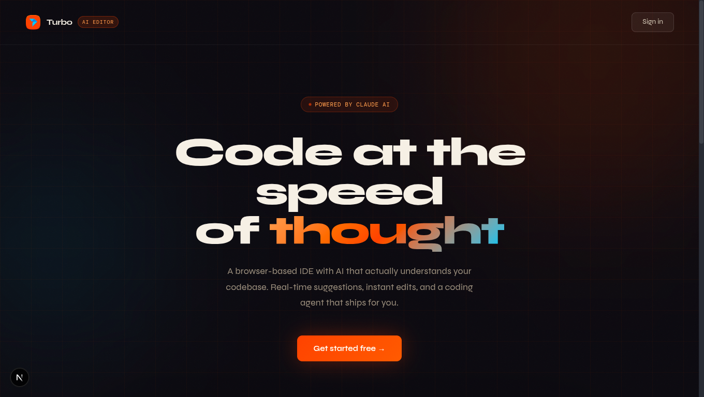

<div align="center">
  <br />
    <a href="https://github.com/Sid2169/turbo" target="_blank">
      
    </a>
  <br />

  <div>


<br/>


  </div>

  <h3 align="center">Turbo — AI-Powered Browser IDE</h3>

  <div align="center">
    A Cursor AI alternative built for the web. Fork this repo to get started! ⭐
  </div>
</div>



[Live Demo](https://turbo-navy-iota.vercel.app/) • [Report Bug](https://github.com/Sid2169/turbo/issues) • [Request Feature](https://github.com/Sid2169/turbo/issues)


# Turbo - A Cursor AI Alternative
 
Turbo is a browser-based IDE inspired by Cursor AI, featuring:

- Real-time collaborative code editing
- AI-powered code suggestions and quick edit (Cmd+K)
- Conversation-based AI assistant
- In-browser code execution with WebContainer
- GitHub import/export integration
- Multi-file project management

## Tech Stack

| Category      | Technologies                                                |
| ------------- | ----------------------------------------------------------- |
| **Frontend**  | Next.js 16, React 19, TypeScript, Tailwind CSS 4            |
| **Editor**    | CodeMirror 6, Custom Extensions, One Dark Theme             |
| **Backend**   | Convex (Real-time DB), Inngest (Background Jobs)            |
| **AI**        | Gemini 3.6 Flash (chat and edits), Gemini 3.5 Flash-Lite (autocomplete) |
| **Auth**      | Clerk (with GitHub OAuth)                                   |
| **Execution** | WebContainer API, xterm.js                                  |
| **UI**        | shadcn/ui, Radix UI                                         |

## Part 1 Contents (Steps 1-12)

### Phase 1: Foundation & Technologies

- **Step 1:** Project Setup, UI Library & Theme
- **Step 2:** Clerk Authentication & Protected Routes
- **Step 3:** Convex Database & Real-time Setup
- **Step 4:** Inngest - Background Jobs & Non-Blocking UI
- **Step 5:** Firecrawl - Teaching AI with Live Documentation
- **Step 6:** Sentry - Error Tracking & LLM Monitoring
- **Step 7:** Projects Dashboard & Landing Page

### Phase 2: File System & Editor

- **Step 8:** Project IDE Layout & Resizable Panes
- **Step 9:** File Explorer - Full Implementation
- **Step 10:** Code Editor & State Management

### Phase 3: AI Features (Partial)

- **Step 11:** AI Suggestions & Quick Edit
- **Step 12:** Conversation System

## Part 2 Contents (Steps 13-16)

- **Step 13:** AI Agent & Tools (AgentKit, file management tools)
- **Step 14:** WebContainer, Terminal & Preview
- **Step 15:** GitHub Import & Export
- **Step 16:** AI Project Creation & Final Polish

## Getting Started

### Prerequisites

- Node.js 20.09+
- npm or pnpm
- Accounts needed:
  - [Clerk](https://cwa.run/clerk) - Authentication
  - [Convex](https://cwa.run/convex) - Database
  - [Inngest](https://cwa.run/inngest) - Background jobs
  - [Google AI Studio](https://aistudio.google.com) - AI API key required
  - [Firecrawl](https://cwa.run/firecrawl) - Web scraping (optional)
  - [Sentry](https://cwa.run/sentry) - Error tracking (optional)

### Installation

1. Clone the repository:

   ```bash
   git clone https://github.com/Sid2169/turbo.git
   cd turbo
   ```

2. Install dependencies:

   ```bash
   npm install
   ```

3. Set up environment variables:

   ```bash
   cp .env.example .env.local
   ```

4. Configure your `.env.local` with the required keys:

   ```env
   # Clerk
   NEXT_PUBLIC_CLERK_PUBLISHABLE_KEY=
   CLERK_SECRET_KEY=

   # Convex
   NEXT_PUBLIC_CONVEX_URL=
   CONVEX_DEPLOYMENT=
   TURBO_CONVEX_INTERNAL_KEY=  # Generate a random string

   # Chat, website generation, autocomplete, and quick edit
   GOOGLE_GENERATIVE_AI_API_KEY=  # Required - Gemini 3.6 Flash / 3.5 Flash-Lite

   # Firecrawl (optional)
   FIRECRAWL_API_KEY=

   # Sentry (optional)
   SENTRY_DSN=
   ```

5. Start the Convex development server:

   ```bash
   npx convex dev
   ```

6. In a new terminal, start the Next.js development server:

   ```bash
   npm run dev
   ```

7. In another terminal, start the Inngest dev server:

   ```bash
   npx inngest-cli@latest dev
   ```

8. Open [http://localhost:3000](http://localhost:3000)

## Project Structure

```
src/
├── app/                    # Next.js App Router
│   ├── api/               # API routes
│   │   ├── messages/      # Conversation API
│   │   ├── suggestion/    # AI suggestions
│   │   └── quick-edit/    # Cmd+K editing
│   └── projects/          # Project pages
├── components/            # Shared components
│   ├── ui/               # shadcn/ui components
│   └── ai-elements/      # AI conversation components
├── features/
│   ├── auth/             # Authentication
│   ├── conversations/    # AI chat system
│   ├── editor/           # CodeMirror setup
│   │   └── extensions/   # Custom extensions
│   ├── preview/          # WebContainer (Part 2)
│   └── projects/         # Project management
├── inngest/              # Inngest client
└── lib/                  # Utilities

convex/
├── schema.ts             # Database schema
├── projects.ts           # Project queries/mutations
├── files.ts              # File operations
├── conversations.ts      # Conversation operations
└── system.ts             # Internal API for Inngest
```

## Features Implemented (Part 1)

### Editor

- Syntax highlighting for JS, TS, CSS, HTML, JSON, Markdown, Python
- Line numbers and code folding
- Minimap overview
- Bracket matching and indentation guides
- Multi-cursor editing

### AI Features

- Real-time code suggestions with ghost text
- Quick edit with Cmd+K (select code + natural language instruction)
- Selection tooltip for quick actions
- Conversation sidebar with message history

### File Management

- File explorer with folder hierarchy
- Create, rename, delete files and folders
- VSCode-style file icons
- Tab-based file navigation
- Auto-save with debouncing

### Real-time

- Convex-powered instant updates
- Optimistic UI updates
- Background job processing with Inngest

## Current Limitations (Part 1)

These features are planned for Part 2:

- AI agent cannot yet modify files (mock response only)
- No message cancellation
- No past conversations dialog
- No code preview/execution
- No GitHub integration
- No AI project generation

## Scripts

```bash
npm run dev       # Start development server
npm run build     # Build for production
npm run start     # Start production server
npm run lint      # Run ESLint
```

## Acknowledgments

- [Cursor](https://cursor.sh) - Inspiration for the project
- [Orchids](https://orchids.app) - Inspiration for the project
- [shadcn/ui](https://ui.shadcn.com) - UI components
- [CodeMirror](https://codemirror.net) - Code editor
